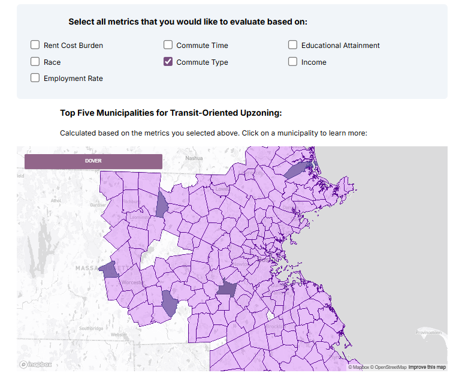

# Dana's Tech World :computer:
Hi! Thanks for checking out my work! This page showcases some of the projects I've worked on either at school or as part of my internships
that I am particularly proud of. Many of these are proof of concept MVPs and not fully polished, but I hope you enjoy them anyway!

*(Extra tip: clicking on the Figma wireframes will take you to the Figma site where you can more easily interact with each wireframe!)*

## Table of Contents
- [Prototype to Reality](#prototype-to-reality)
- [Interactive Data Visualization](#interactive-data-visualization)
<!-- - [Static Pages](#static-pages) -->

## Prototype to Reality

| Project | Description | Preview |
| ------------- | ----------- | ------- |
| [PassTheMic](https://passthemic-2.vercel.app/)    | A social media webapp designed to transcend language barriers and eliminate phone tag by only allowing users to communicate through voice and video messages in the form of private messages. The single-page icon-based design allows users from any generation and region to use the app.    | <iframe style="border: 1px solid rgba(0, 0, 0, 0.1);" width="400" height="250" src="https://www.figma.com/embed?embed_host=share&url=https%3A%2F%2Fwww.figma.com%2Ffile%2FWNYTy6YnxG6P5uVi9uR61e%2FA3-wireframes%3Ftype%3Ddesign%26node-id%3D0%253A1%26mode%3Ddesign%26t%3DLsXkj6pK3DHwvBTx-1" allowfullscreen></iframe> |
| [WasteWise](https://drive.google.com/file/d/1n5PTZC5BdhcAvGiIlk54REezQV6JTOWV/view)    | An app that makes properly disposing of any item effortless. Users can search for and locate waste bins that accept the item they are trying to throw away (i.e. a compost bin for a banana peel). A map shows users all the possible bin locations, how full each bin is, and what items that bin accepts. *(Worked as part of a team to ideate, design, implement, test, and iterate)*    | <iframe style="border: 1px solid rgba(0, 0, 0, 0.1);" width="400" height="250" src="https://embed.figma.com/design/SY8pwlYwSjEkIm32CZoSz5/%5B6.170%5D-Final-Project?node-id=0-1&embed-host=share" allowfullscreen></iframe> |
| TagTeam    | A new easy way of finding teammates during an event based on skills, work ethics, interests, and personality. A weighting algorithm determines the compatability of partners based on their self-provided user tags. *(Worked as part of a team to ideate, design, implement, test, and iterate in 1 month)*       | <iframe style="border: 1px solid rgba(0, 0, 0, 0.1);" width="400" height="250" src="https://embed.figma.com/design/vWDBMcvblOsrUmhG4ijTZ9/TagTeam?node-id=2401-122&embed-host=share" allowfullscreen></iframe> |
| Innovative Ideation Workshop    | A digital version of an in-person workshop used to teach participants innovative thinking and brainstorming.        | <iframe style="border: 1px solid rgba(0, 0, 0, 0.1);" width="400" height="250" src="https://embed.figma.com/design/BfDew5XBaNmS3LKTq9Aslc/Innovative-Ideas-Workshop?node-id=0-1&embed-host=share" allowfullscreen></iframe> |

## Interactive Data Visualization
In a world of numbers and big data, we need a way to easily and accurately communicate the information that data can convey. 
Interactive data visualizations are a method of representing data analysis that allows a user to navigate through the experience at 
their own pace and allows the authors to tell the hidden stories behind the data. 

My team and I investigated the Boston metropolitan area's housing markets and how the MBTA Communities Act can potentially affect each municipality in 
the following interactive data visualization:
[Prioritizing Municipalities for Compliance With the MBTA Communities Act](https://juliacamacho.github.io/6c35_final/).

{width=600px}

<!-- ## Static Pages
[Aquapressure](https://aquapressure.org/) 

[2024 Brass Rat](http://brassrat2024.mit.edu/) -->

<!-- ## Research
[Emotional Reappraisal Study](https://pubmed.ncbi.nlm.nih.gov/38917180/) -->

